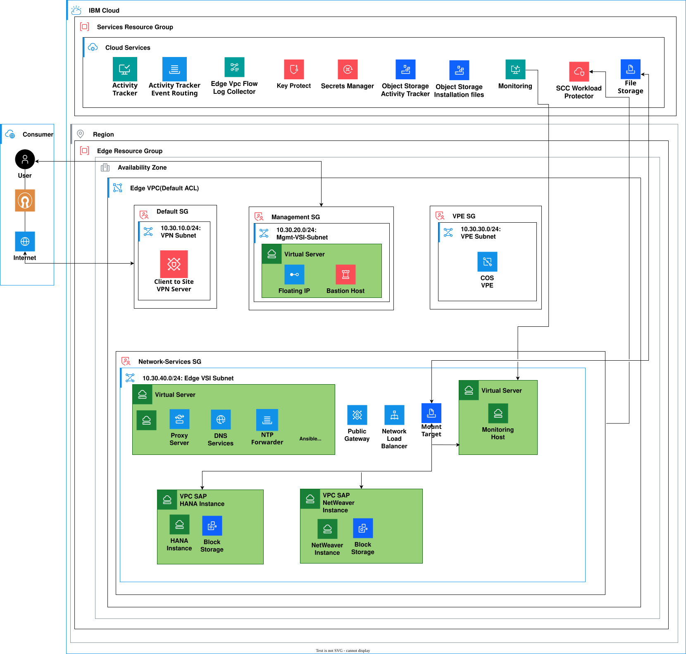
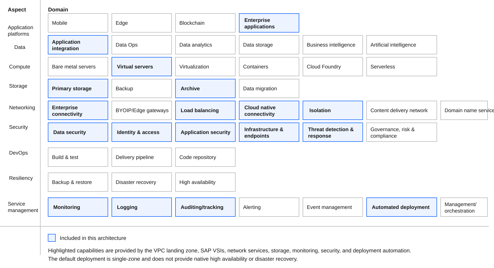

---
copyright:
  years: 2026
lastupdated: "2026-09-07"
keywords:
  - SAP
  - SAP HANA
  - SAP Ready
  - IBM Cloud VPC
  - deployable architecture
subcollection: deployable-reference-architectures
authors:
  - name: Suraj Bharadwaj
  - name: Lavanya B N
production: true
docs: https://cloud.ibm.com/docs/sap
image_source: https://github.com/terraform-ibm-modules/terraform-ibm-vpc-sap/blob/main/reference-architectures/sap-ready-to-go/deploy-arch-ibm-vpc-sap-ready-to-go.svg
use-case: ITServiceManagement
industry: Technology
compliance: SAPCertified
content-type: reference-architecture
version: v1.0.0
related_links:
  - title: 'SAP in IBM Cloud documentation'
    url: 'https://cloud.ibm.com/docs/sap'
    description: 'SAP in IBM Cloud documentation.'
  - title: 'SAP Ready on VPC'
    url: 'https://github.com/terraform-ibm-modules/terraform-ibm-vpc-sap/tree/main/solutions/ibm-catalog/sap-ready-to-go'
    description: 'Terraform implementation of the SAP Ready solution.'
---

{{site.data.keyword.attribute-definition-list}}

# SAP Ready on IBM Cloud VPC
{: #sap-ready-to-go}
{: toc-content-type="reference-architecture"}
{: toc-industry="Technology"}
{: toc-use-case="ITServiceManagement"}
{: toc-compliance="SAPCertified"}
{: toc-version="v1.0.0"}

The SAP Ready on IBM Cloud Virtual Private Cloud (VPC) deployable architecture creates a secure VPC landing zone with SAP HANA DB and SAP NetWeaver (Application) Virtual Server Instances (VSIs) that are fully configured and tuned for SAP workloads.

The solution creates and configures the VPC infrastructure, network services, storage, and operating system prerequisites. It tunes the instances according to SAP best practices using RHEL System Roles. It does not install SAP software — the deployed instances are ready for SAP installation.

The default deployment is designed for a single VPC zone. It does not provide native high availability or disaster recovery.

## Architecture diagram
{: #sap-ready-to-go-architecture-diagram}

{: caption="Figure 1. SAP Ready on IBM Cloud VPC" caption-side="bottom"}{: external download="deploy-arch-ibm-vpc-sap-ready-to-go.svg"}

## Design requirements
{: #sap-ready-to-go-design-requirements}

{: caption="Figure 2. Scope of the solution requirements" caption-side="bottom"}{: external download="heat-map-deploy-arch-ibm-vpc-sap-ready-to-go.svg"}

The reference architecture provides an automated foundation for deploying SAP workloads on IBM Cloud VPC. The architecture focuses on secure network isolation, centralized infrastructure services, SAP-certified compute profiles, and automated operating system configuration and SAP tuning.

## Components
{: #sap-ready-to-go-components}

### VPC architecture decisions
{: #sap-ready-to-go-vpc-components}

| Requirement | Component | Choice | Alternative choice |
| ------------- | ----------- | -------- | -------------------- |
| Ensure public internet connectivity while isolating application workloads from direct public access | VPC landing zone and security groups | Use the VPC landing zone network and security group configuration | Create and maintain a custom VPC network and security group design |
| Provide controlled administrative access | Bastion or management VSI | Use a dedicated management VSI as the SSH entry point to the environment | Configure a customer-managed bastion host |
| Provide DNS and NTP services to all VPC instances | Network services VSI | Configure a central network services VSI as the DNS forwarder and NTP server | Use customer-managed DNS and NTP services |
| Provide a proxy for outbound network access | Network services VSI | Configure Squid on the network services VSI | Configure a separate proxy service or network load balancer |
| Provide shared storage for shared SAP directories | VPC file storage and NFS services | Configure an NFS server and mount the share on the SAP VSIs | Use an existing customer-managed NFS service |
| Provide private access to IBM Cloud services | VPC service endpoints and COS VPE | Use private connectivity to IBM Cloud Object Storage where configured | Use an approved customer-managed connectivity pattern |
| Provide network monitoring and audit information | Flow Logs and Activity Tracker | Enable VPC Flow Logs and Activity Tracker according to deployment parameters | Use existing enterprise monitoring and audit services |
| Support optional security monitoring | Security and Compliance Center Workload Protection | Optionally install and configure the Workload Protection agent on the created VSIs | Use an existing security monitoring platform |
{: caption="Table 1. VPC architecture decisions" caption-side="bottom"}

### SAP compute architecture decisions
{: #sap-ready-to-go-compute-components}

| Requirement | Component | Choice | Alternative choice |
| ------------- | ----------- | -------- | -------------------- |
| Deploy an SAP HANA database server | SAP HANA VSI | Create one VPC VSI using a customer-selected SAP HANA-certified profile and image | Deploy SAP HANA on an existing customer-managed VSI |
| Deploy SAP application services | SAP NetWeaver VSI | Create one VPC VSI for the SAP NetWeaver application server | Deploy on a separate customer-managed VSI |
| Use SAP-certified operating systems | VPC operating system images | Use SAP HANA-certified and SAP Applications-certified RHEL or SLES images | Provide other supported SAP-certified images manually |
| Configure SAP HANA filesystems | Block volumes attached to the HANA VSI | Automatically calculate storage based on the selected HANA profile, or provide a custom storage layout | Attach and configure storage manually |
| Configure SAP application filesystems | Block volumes attached to the application VSI | Configure `/usr/sap`, `swap`, and `/sapmnt` using the solution defaults or custom values | Attach and configure storage manually |
| Connect SAP instances to infrastructure services | DNS, NTP, and NFS client configuration | Configure the SAP VSIs to use the central DNS, NTP, and NFS services | Configure infrastructure services manually |
| Tune operating system for SAP workloads | RHEL System Roles | Apply `sap_general_preconfigure`, `sap_hana_preconfigure`, and `sap_netweaver_preconfigure` roles | Perform OS tuning manually |
{: caption="Table 2. SAP compute and storage architecture decisions" caption-side="bottom"}

### Security and credentials architecture decisions
{: #sap-ready-to-go-security-components}

| Requirement | Component | Choice | Alternative choice |
| ------------- | ----------- | -------- | -------------------- |
| Access VPC instances securely | RSA SSH key pair | Require an RSA public and private key pair for instance access | Use an approved enterprise SSH access solution |
| Restrict administrative network access | External access IP or CIDR | Allow SSH access only from the specified external IP address or CIDR range | Use a customer-managed VPN or private access path |
| Protect deployment credentials | Sensitive Terraform variables | Mark API keys, private SSH keys, and Ansible Vault passwords as sensitive inputs | Use an approved secrets-management integration |
| Protect generated automation files | Ansible Vault | Encrypt generated OS configuration playbooks with the supplied Ansible Vault password | Encrypt and manage the files using an enterprise secrets platform |
| Protect IBM Cloud service access | IAM and service credentials | Use IBM Cloud API credentials with the minimum permissions required by the deployment | Use an enterprise IAM delegation model |
{: caption="Table 3. Security and credentials architecture decisions" caption-side="bottom"}
