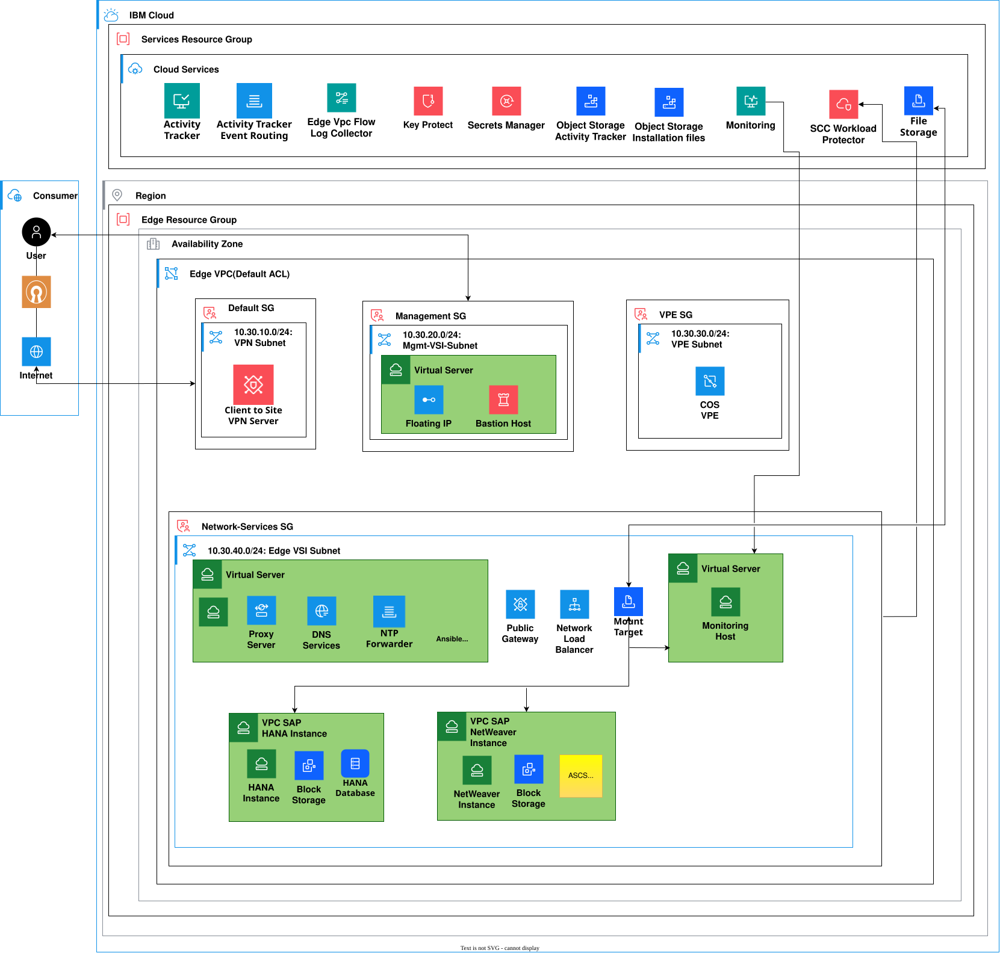

---
copyright:
  years: 2024, 2025, 2026
lastupdated: "2026-08-18"
keywords:
  - SAP
  - SAP HANA
  - SAP S/4HANA
  - SAP BW/4HANA
  - IBM Cloud VPC
  - deployable architecture
subcollection: deployable-reference-architectures
authors:
  - name: Suraj Bharadwaj
  - name: Lavanya B N
production: true
docs: https://cloud.ibm.com/docs/sap
image_source: https://github.com/terraform-ibm-modules/terraform-ibm-vpc-sap/blob/main/reference-architectures/sap-s4hana-bw4hana/deploy-arch-ibm-vpc-sap-s4hana-bw4hana.svg
use-case: ITServiceManagement
industry: Technology
compliance: SAPCertified
content-type: reference-architecture
version: v1.0.0
related_links:
  - title: 'SAP in IBM Cloud documentation'
    url: 'https://cloud.ibm.com/docs/sap'
    description: 'SAP in IBM Cloud documentation.'
  - title: 'SAP HANA with SAP S/4HANA or SAP BW/4HANA on VPC'
    url: 'https://github.com/terraform-ibm-modules/terraform-ibm-vpc-sap/tree/main/solutions/ibm-catalog/sap-s4hana-bw4hana'
    description: 'Terraform implementation of the SAP solution.'
---

{{site.data.keyword.attribute-definition-list}}

# SAP HANA with SAP S/4HANA or SAP BW/4HANA on IBM Cloud VPC
{: #sap-s4hana-bw4hana}
{: toc-content-type="reference-architecture"}
{: toc-industry="Technology"}
{: toc-use-case="ITServiceManagement"}
{: toc-compliance="SAPCertified"}
{: toc-version="v1.0.0"}

The SAP HANA with SAP S/4HANA or SAP BW/4HANA on IBM Cloud Virtual Private Cloud (VPC) deployable architecture creates a basic SAP landscape consisting of an SAP HANA database and an SAP NetWeaver application server.

The solution creates and configures the VPC infrastructure, network services, storage, operating systems, and SAP installation prerequisites. It supports automated installation of SAP S/4HANA and SAP BW/4HANA using installation media stored in IBM Cloud Object Storage.

The default deployment is designed for a single VPC zone. It does not provide native high availability or disaster recovery.

## Architecture diagram
{: #sap-s4hana-bw4hana-architecture-diagram}

{: caption="Figure 1. SAP HANA with SAP S/4HANA or SAP BW/4HANA on IBM Cloud VPC" caption-side="bottom"}{: external download="deploy-arch-ibm-vpc-sap-s4hana-bw4hana.svg"}

## Design requirements
{: #sap-s4hana-bw4hana-design-requirements}

{: caption="Figure 2. Scope of the solution requirements" caption-side="bottom"}{: external download="heat-map-deploy-arch-ibm-vpc-sap-s4hana-bw4hana.svg"}

The reference architecture provides an automated foundation for deploying SAP workloads on IBM Cloud VPC. The architecture focuses on secure network isolation, centralized infrastructure services, SAP-certified compute profiles, automated operating system configuration, and SAP software installation.

## Components
{: #sap-s4hana-bw4hana-components}

### VPC architecture decisions
{: #sap-s4hana-bw4hana-vpc-components}

| Requirement | Component | Choice | Alternative choice |
| ------------- | ----------- | -------- | -------------------- |
| Ensure public internet connectivity while isolating application workloads from direct public access | VPC landing zone and security groups | Use the VPC landing zone network and security group configuration | Create and maintain a custom VPC network and security group design |
| Provide controlled administrative access | Bastion or management VSI | Use a dedicated management VSI as the SSH entry point to the environment | Configure a customer-managed bastion host |
| Provide DNS and NTP services to all VPC instances | Network services VSI | Configure a central network services VSI as the DNS forwarder and NTP server | Use customer-managed DNS and NTP services |
| Provide a proxy for outbound network access | Network services VSI | Configure Squid on the network services VSI | Configure a separate proxy service or network load balancer |
| Provide shared storage for installation media and shared SAP directories | VPC file storage and NFS services | Configure an NFS server and mount the share on the SAP VSIs | Use an existing customer-managed NFS service |
| Provide private access to IBM Cloud services | VPC service endpoints and COS VPE | Use private connectivity to IBM Cloud Object Storage where configured | Use an approved customer-managed connectivity pattern |
| Provide network monitoring and audit information | Flow Logs and Activity Tracker | Enable VPC Flow Logs and Activity Tracker according to deployment parameters | Use existing enterprise monitoring and audit services |
| Support optional security monitoring | Security and Compliance Center Workload Protection | Optionally install and configure the Workload Protection agent on the created VSIs | Use an existing security monitoring platform |
{: caption="Table 1. VPC architecture decisions" caption-side="bottom"}

### SAP compute architecture decisions
{: #sap-s4hana-bw4hana-compute-components}

| Requirement | Component | Choice | Alternative choice |
| ------------- | ----------- | -------- | -------------------- |
| Deploy an SAP HANA database server | SAP HANA VSI | Create one VPC VSI using a customer-selected SAP HANA-certified profile and image | Deploy SAP HANA on an existing customer-managed VSI |
| Deploy SAP application services | SAP NetWeaver VSI | Create one VPC VSI hosting the SAP NetWeaver PAS and ASCS instances | Deploy PAS and ASCS on separate customer-managed VSIs |
| Use SAP-certified operating systems | VPC operating system images | Use SAP HANA-certified and SAP Applications-certified RHEL or SLES images | Provide other supported SAP-certified images manually |
| Configure SAP HANA filesystems | Block volumes attached to the HANA VSI | Automatically calculate storage based on the selected HANA profile, or provide a custom storage layout | Attach and configure storage manually |
| Configure SAP application filesystems | Block volumes attached to the application VSI | Configure `/usr/sap`, `swap`, and `/sapmnt` using the solution defaults or custom values | Attach and configure storage manually |
| Connect SAP instances to infrastructure services | DNS, NTP, and NFS client configuration | Configure the SAP VSIs to use the central DNS, NTP, and NFS services | Configure infrastructure services manually |
| Install SAP software | Ansible and SAP installation automation | Download installation media from COS and execute SAP HANA and SAP solution installation automation | Install SAP software manually |
{: caption="Table 2. SAP compute and storage architecture decisions" caption-side="bottom"}

### SAP solution architecture decisions
{: #sap-s4hana-bw4hana-sap-components}

| Requirement | Component | Choice | Alternative choice |
| ------------- | ----------- | -------- | -------------------- |
| Support SAP S/4HANA | SAP S/4HANA | Support SAP S/4HANA 2020, 2021, 2022, and 2023 according to the selected input | Install another SAP release manually |
| Support SAP BW/4HANA | SAP BW/4HANA | Support SAP BW/4HANA 2021 according to the selected input | Install another SAP release manually |
| Store installation media | IBM Cloud Object Storage | Use an existing COS bucket containing the required HANA and SAP solution media | Upload and manage the installation media manually |
| Retrieve installation media securely | COS service credentials | Accept COS service credentials as a sensitive deployment input | Use an alternative approved credential-management workflow |
| Configure SAP system identity | SAP HANA and SAP solution variables | Allow the customer to specify SAP SIDs and instance numbers | Configure the SAP system identity manually after deployment |
{: caption="Table 3. SAP solution architecture decisions" caption-side="bottom"}

### Security and credentials architecture decisions
{: #sap-s4hana-bw4hana-security-components}

| Requirement | Component | Choice | Alternative choice |
| ------------- | ----------- | -------- | -------------------- |
| Access VPC instances securely | RSA SSH key pair | Require an RSA public and private key pair for instance access | Use an approved enterprise SSH access solution |
| Restrict administrative network access | External access IP or CIDR | Allow SSH access only from the specified external IP address or CIDR range | Use a customer-managed VPN or private access path |
| Protect deployment credentials | Sensitive Terraform variables | Mark API keys, private SSH keys, COS credentials, SAP passwords, and Ansible Vault passwords as sensitive inputs | Use an approved secrets-management integration |
| Protect generated automation files | Ansible Vault | Encrypt generated SAP installation variables and playbooks with the supplied Ansible Vault password | Encrypt and manage the files using an enterprise secrets platform |
| Protect IBM Cloud service access | IAM and service credentials | Use IBM Cloud API credentials with the minimum permissions required by the deployment | Use an enterprise IAM delegation model |
{: caption="Table 4. Security and credentials architecture decisions" caption-side="bottom"}
